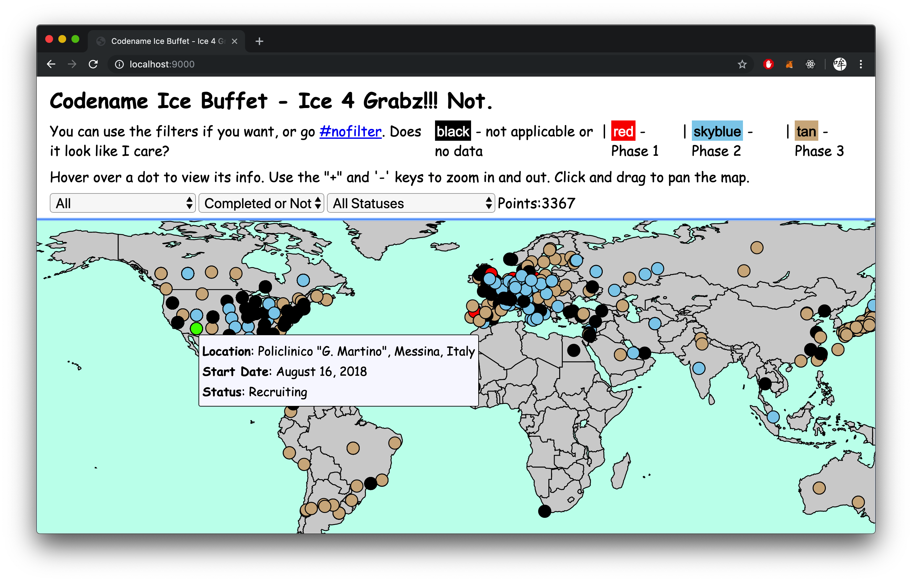
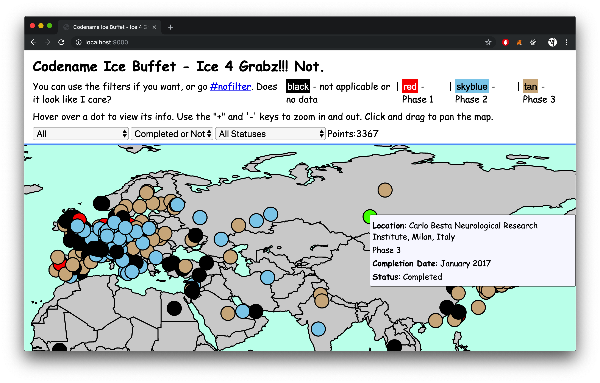

# Codename Ice Buffet

Submission for Track 02 (Visualization) #HACKtheWAVE 2019 in Honolulu, Hawaii.
Used Node.js with D3 and Webpack.

## Getting Started
Clone, then `npm install`. Build using `npm run-script build`. Start using `npm start`, assuming you and `http-server` installed first.

## Screenshots

 

